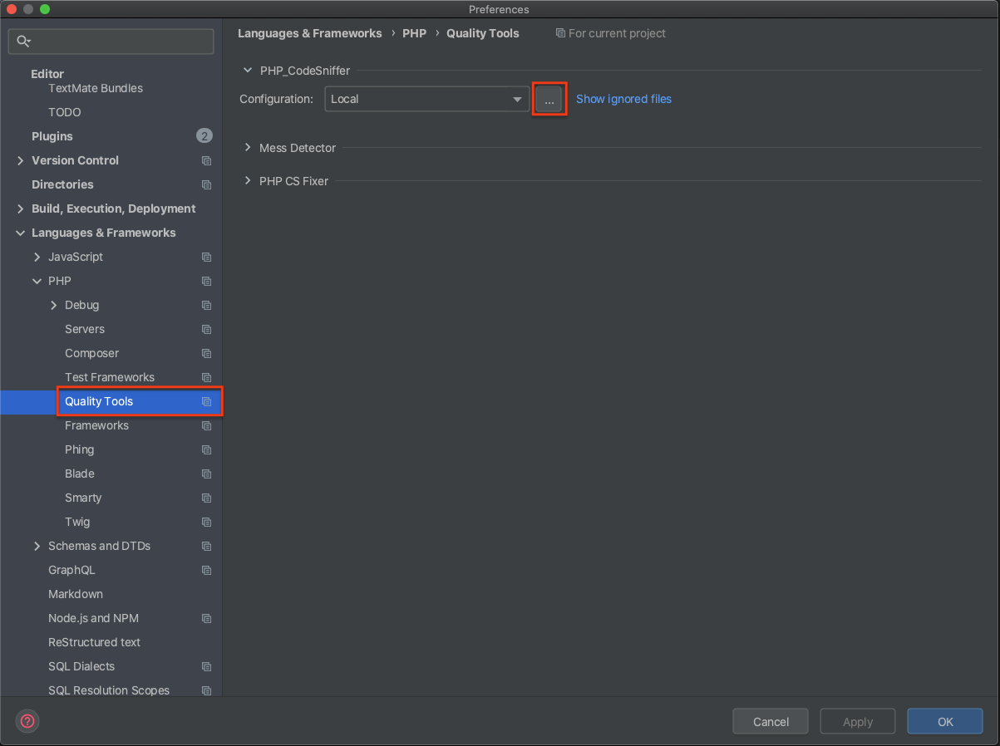
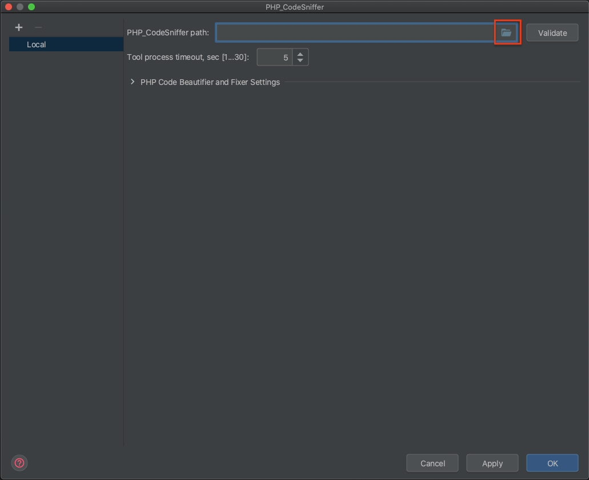
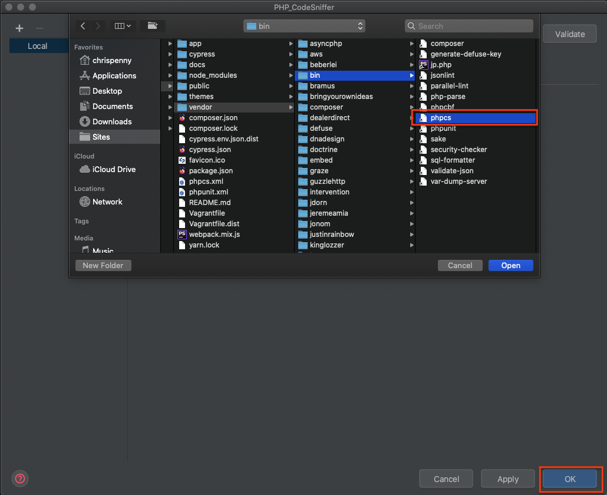
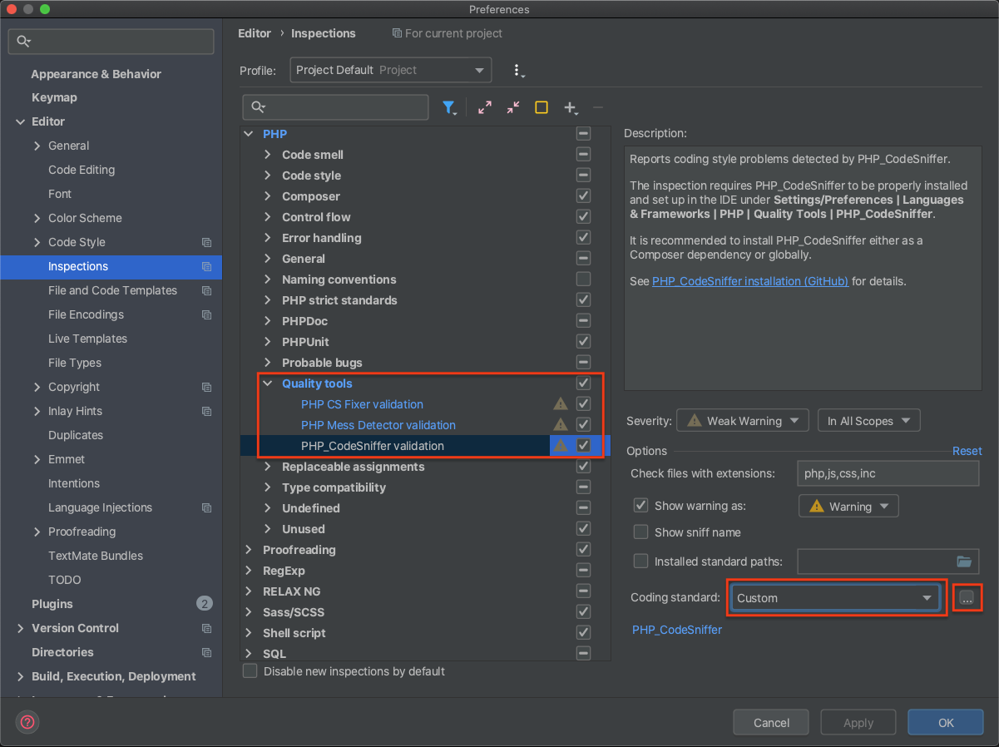
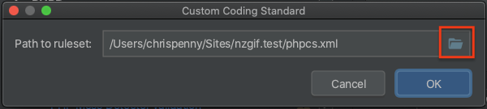
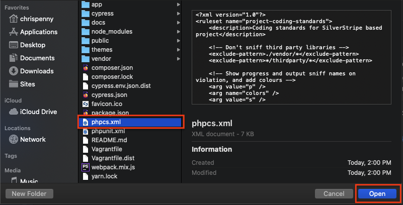
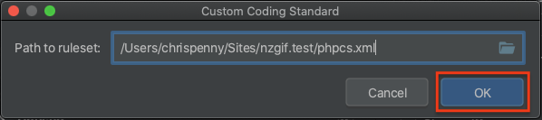
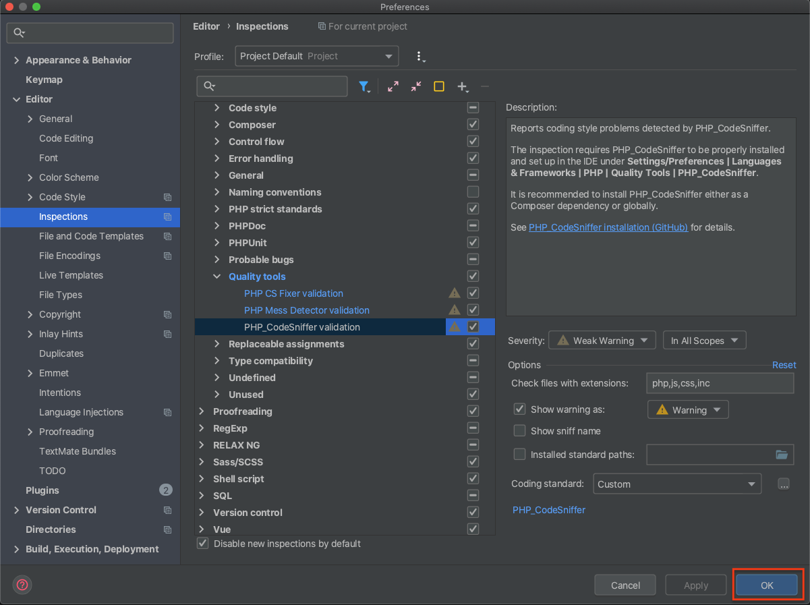

# Coding Standards

## PHP (PSR-2)

The skeleton comes with Slevomat Coding Standards.

To run the Standards test.

```
$ composer silverstripe-standards
```

To fix your Standards violations you can run.

```
$ composer phpcs-fix
# or
$ composer phpcbf
```

## PHPStorm

Instructions for setting up PHPStorm with a code sniffer can be found here:
https://confluence.jetbrains.com/display/PhpStorm/PHP+Code+Sniffer+in+PhpStorm#PHPCodeSnifferinPhpStorm-1.EnablePHPCodeSnifferintegrationinPhpStorm
















