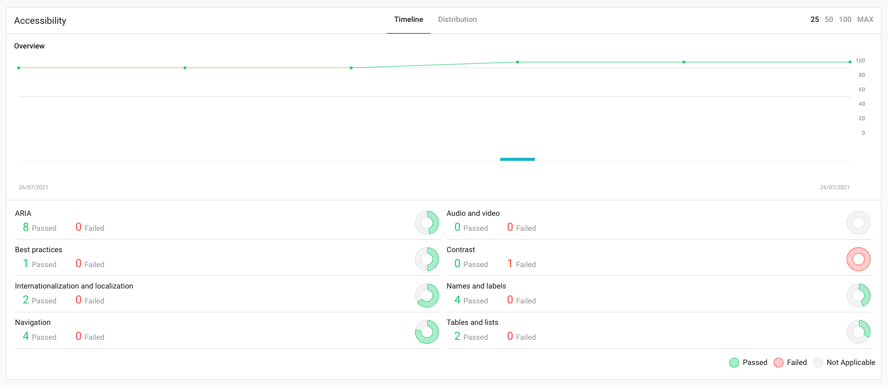
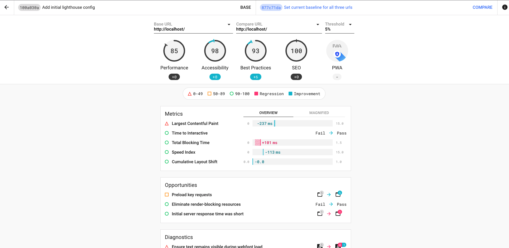
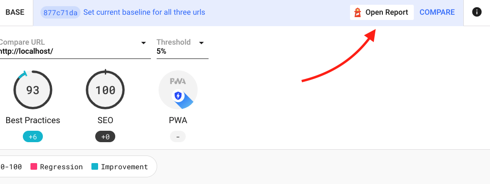
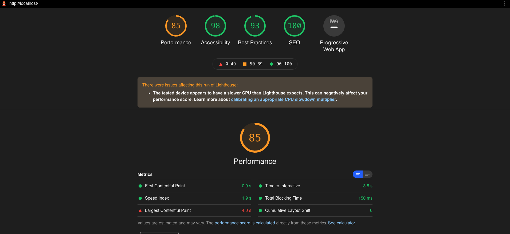
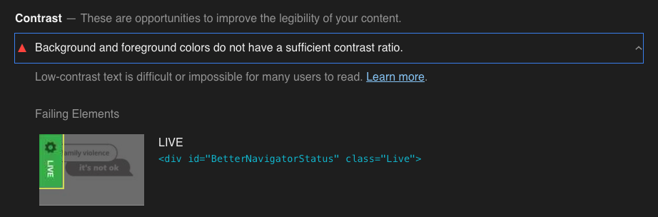

# Lighthouse CI

## Summary

[Lighthouse](https://developers.google.com/web/tools/lighthouse) is a tool built into Google Chrome for performing tests and improving the quality of websites.

It checks several areas of a site; performance, best practice, seo, accessibility and pwa, performing many small tests to build a score for each. Sites with higher scores normally perform better for users.

Once this is installed, it checks a set of pre-defined urls against a minimum set of scores during the continuous integration build. If the site falls below those, then either a warning, or error is output stopping the build.

### Remember

Automated testing will only give you part of the story, it should not be relied on at the expense of other methods.

## Installation

See the [installation notes for setup with project-skeleton](https://silverstripe.atlassian.net/wiki/spaces/DEV/pages/1626013805/How+to+setup+CircleCI+for+Project+Skeleton#Enabling-Lighthouse-checks).

### Recommended usage

While this can be used as a set and forget set of checks, in most projects this will need to be tweaked as the project progresses. The minimum score allowed for each facet should be increased gradually to prevent regression as new code is added.

In addition you may want to include multiple example pages in the configuration, for example one url for each page type used in the site.

These tweaks are done in the `.lighthouserc.json` file.

## Reporting

[View the reporting interface](https://lighthouse-silverstripe.herokuapp.com/)

The interface uses BasicAuth, credentials can be found in LastPass (search for _'Lighthouse CI Server BasicAuth'_)

### Dashboard

The dashboard shows the various scores plotted over time, with new data points added for each run. Each section is broken down into several sub-scores for various parts of each test.

### Comparison

By pressing the builds, you can compare the scores against the base branch (normally `develop`) or another commit.

This is helpful for identifying where an issue could have been introduced, or simply for showing how far you have come.

### Report viewer

When hovering over the commit on the comparison page a link to 'Open Report' is shown allowing you to view the original report in the same way as it displays in the Chrome dev tools.

This screen includes more detail on how the test progressed as well as screenshot timeline and recommendations to resolve issues.

## Fixing issues

The best way to identify issues is via the Report viewer which identifies any failing audits and gives a link to learn more about the test conducted.

In some cases, issues identified might be in third-party modules so fixing them might not be feasible.

## Useful links

* [Lighthouse overview](https://developers.google.com/web/tools/lighthouse)
* [GoogleChrome/lighthouse-ci on Github](https://github.com/GoogleChrome/lighthouse-ci)

