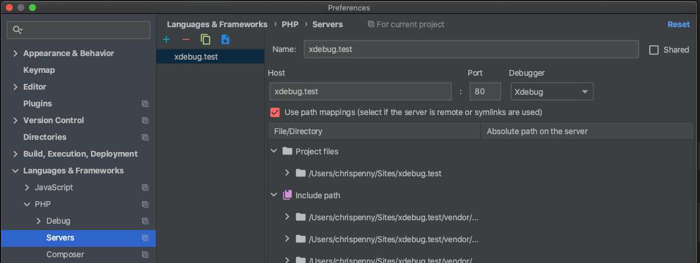
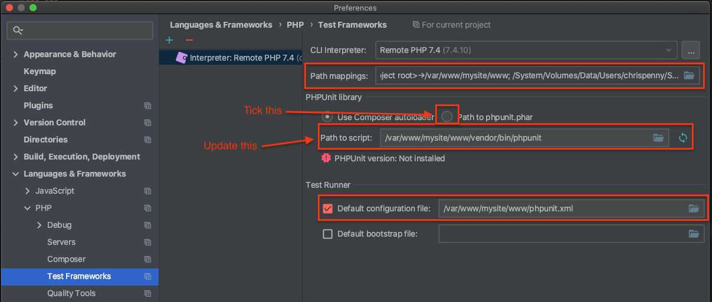

# PHPStorm

- [Set up XDebug](#set-up-xdebug)
- [Running XDebug](#running-xdebug)
- [Set up PHPUnit](#set-up-phpunit)
- [Running PHPUnit](#running-phpunit)

## Set up XDebug

1) Open preferences (`CMD + ,`)

2) Go to Languages & Frameworks > PHP > Servers

3) Click the “+” to create a new Server

4) Give your server a name, and set the Host

The Server name can be anything you like. The Host should be whatever your domain for your project is (the `HOSTNAME`
set in your .env)

5) Enable "path mappings"

6) Set up your path mapping

Here we need to tell PHPStorm which local directory (on our machine) maps to the public directory within our VM. The
public directory for all of our VMs is `/var/www/mysite/www`. The local directory will change depending on where you
keep your projects.

7) You should now be good to go with [Running XDebug](#running-xdebug)

## Running XDebug

1) Grab yourself an XDebug helper

- [Firefox Plugin](https://addons.mozilla.org/en-US/firefox/addon/xdebug-helper-for-firefox/)
- [Chrome Plugin](https://chrome.google.com/webstore/detail/eadndfjplgieldjbigjakmdgkmoaaaoc)

2) Enable XDebug in your VM

See [XDebug Doc](xdebug.md) for instructions

3) Add break point in your application

`PageController::init()` is an easy one to choose. You can add a breakpoint simply by clicking to the left side of the
line you wish to add the breakpoint to (the [red dot] in the screenshot below).

4) Turn on debug in browser

5) Start listening for PHP Debug connections in your IDE

6) Load the site in your browser, and it should hit your break point

## Set up PHPUnit

1) Open preferences (`CMD + ,`)

2) Go to Languages & Frameworks > PHP

At this point, you will most likely see that you do not have a CLI Interpreter set. We will need to add one, or if you
already have one set, we'll want to make sure it's set up correctly.

3) Open the CLI Interpreter settings

4) Create a new interpreter from Vagrant

If you have an existing interpreter, then make sure it's of the correct type, if it isn't, you can either edit it, or
create a new one as we are doing below.

5) Select the checkbox for Vagrant

PHPStorm might already know what your Vagrant Instance Folder is (if you have already set up XDebug). If it doesn't,
set it manually.

Once you select your Vagrant Instance Folder, PHPStorm will do some "magic" (you can just barely see the loading
spinner in the screenshot below). Let it do its thing.

Once it has finished its "magic", you should see something similar to the screenshot below:

6) Hit "OK"

7) Set up your path mapping

Once again we need to tell PHPStorm how our local directory maps to the public directory in our VM.

8) Update or create your path mapping

If you already have a path mapped for your project directory, then just make sure it's correct. If you don't have one,
then hit the Add button

9) Set the correct paths

You can use the [folder] button to find your local directory. The remote directory should be `/var/www/mysite/www`,
unless you have specifically changed this for your VM.

10) Hit "OK"

Your Path mappings should now look something like the screenshot below.

11) Go to Languages & Frameworks > PHP > Test Frameworks

We need to have a "Remote Interpreter". You might already have one. If you do, you can just check to see that your
settings are correct.

12) Create or update your PHPUnit Remote Interpreter

13) Choose your remote PHP Interpreter

If you don't have a remote PHP Interpreter, then you probably still need to create one from Step 4.

14) Check that your mappings are all correct

There are three mappings that could be incorrect, and if any of them are, things won't work.

The first one is your path mappings from Step 7, and if you open the folder, you should see exactly the same thing as
previously.

Path mappings.

The other two are your VM directories. Sometimes PHPStorm can get these a little wrong, so it can be best to just open
up the folder and browse to your PHPUnit script, and your PHPUnit config.

Note: Remember, this is the folder structure of your VM. When you open the [folder], you'll need to browse to:
`/var/www/mysite/www`

For phpunit, you should find it under `/var/www/mysite/www/vendor/bin/phpunit`.
For your config, you should find it under `/var/www/mysite/www/phpunit.xml`.

15) You should now be good to go with [Running PHPUnit](#running-phpunit)

## Running PHPUnit

You can right click on a particular folder and run all tests for that folder.

You can click on the "test" arrow next to a class declaration to run all tests that are within that class.

You can click on the "test" arrow next to a particular method to run just that single test.

Note: This does not include any `flush=1`, if you need to flush your tests, you will need to do that through CLI. I
haven't looked into whether you can get PHPStorm to append this - but, given that you wouldn't want to append it every 
time you run a test, I generally don't mind the one off request in CLI to clear the cache.
